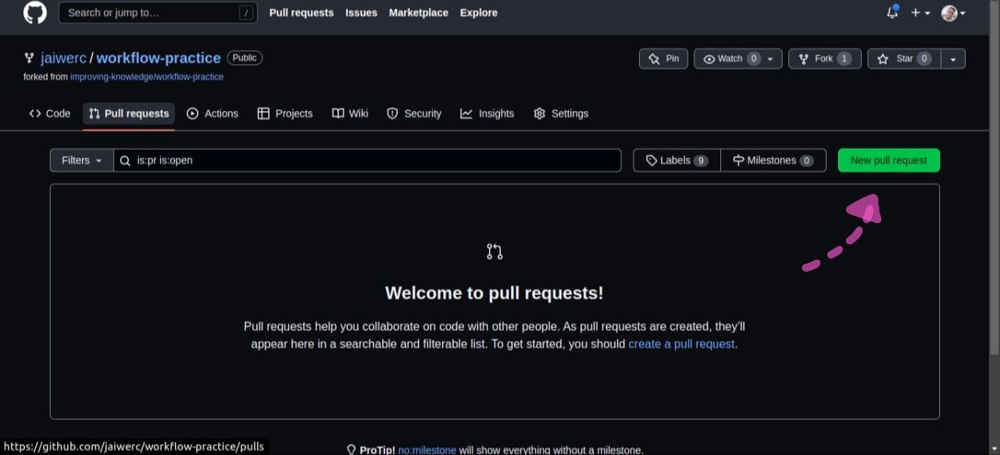
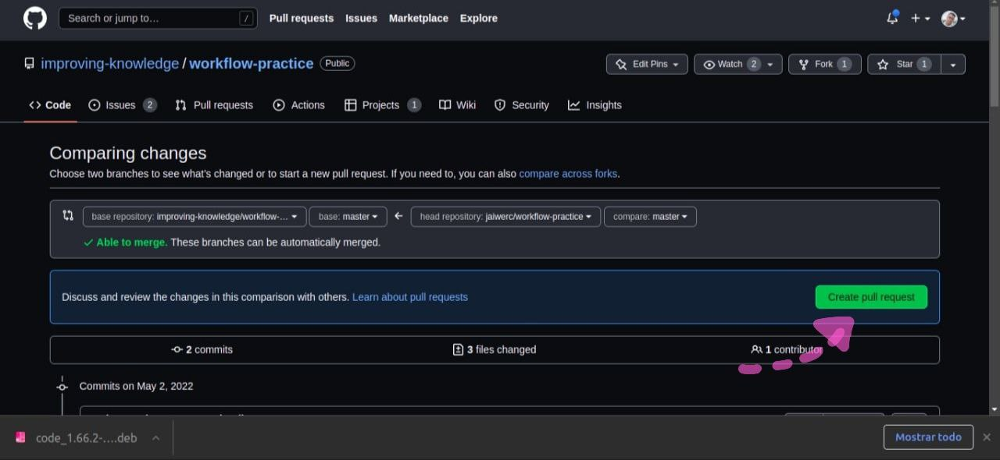
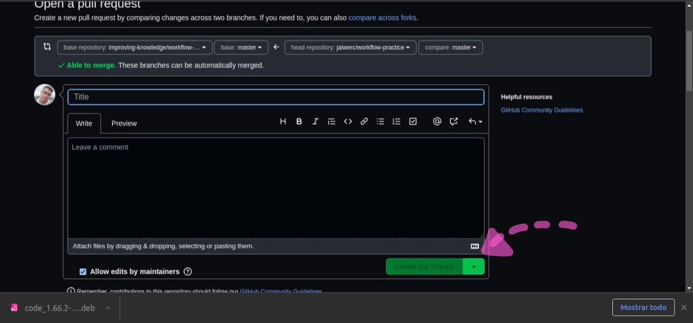

# Notas personales de Jaiwer Castillo

## Comandos aprendidos

#### Git init. Con git init inicias un repositorio para poder trabajar con git. Ejemplo:
```Shell 
git init
```

#### Luego de haber iniciado con "git init" viene la iteración básica. 

#### Iteración básica

#### Git status. Te permite ver el estado de los archivos del repo. Si haces algun cambio y quieres estar seguro si se completó, basta con colocar este comando y te muestra: 
```Shell
git status
```
#### Git add. Se usa para agregar cambios al staging área. Hay diferentes formas de usar el "git add". Ejemplo: 

#### Agrega el cambio o creación del archivo de manera individual:
```Shell

git add [nombre del archivo] 

$ git add archivo1.txt
```
#### Agrega los cambios de todos los archivos creados:
```Shell
git add -A
```
#### Agrega varios cambios a la vez:
```Shell
git add [nombre de archivo]/[nombre de archivo]/[nombre de archivo]

$ git add archivo1.txt/archivo2.txt/archivo3.txt
```

#### Git commit. Inserta los archivos que se encuentren en el staging área y los coloca en el repositorio. El "git add" junto al "git commit" se define como el proceso básico de GIT. Hay diferentes formas de usar el "git commit". Ejemplo:
```Shell 
git commit -m "nombre del título de commit"

$ git commit -m "Base de proyecto de práctica"  
```

#### Puedes editar el commit mas reciente: 
```Shell 
git commit --amend 
```

***[Volver al inicio](#notas-personales-de-jaiwer-castillo)***

#### Git clone. Crea una copia de un repositorio existente en tu terminal. Clonar es el camino más común para obtener una copia de un proyecto. Git clone se usa así: 
```Shell
git clone [Dirección del repositorio]

$ git clone git@github.com:jaiwerc/workflow-practice.git
```
#### Git checkout. Te permite mover entre commits y archivos, git checkout también te permite moverte entre ramas.

#### Para usarlo entre commits es:
```Shell
git checkout [ID del commit]

$ git checkout 24f8919faf4dc2a72d5c3051ce2306fc6bb5515d
```
#### Para usarlo entre ramas es:
```Shell
git checkout [nombre de la rama]

$ git checkout experimental
```

#### Git branch. Te permite crear una rama nueva. Una vez creada, debes ubicarte en ella para comenzar a trabajar en tu nueva rama. Su iteración es: 

#### Para crear la rama:
```Shell 
git branch [nombre de la rama a crear]

$ git branch experimental
```

#### Para moverte hacia ella:
```Shell
git checkout [nombre de la rama creada]  

$ git checkout experimental 
```


***[Volver al inicio](#notas-personales-de-jaiwer-castillo)*** 


#### Git log. Te ayuda a explorar las previas revisiones de un proyecto: 
```Shell 
git log
```

#### Git alias. Es un comando que te permite crear tus propios comandos de GIT a partir de otros. Este comando a continuación te permite ver "git log" de una manera más dinámico, aparte de que ayuda mucho a la hora de usar "git log":
```Shell
$ git config --global alias.superlog "log --graph --abbrev-commit --decorate --format=format:'%C(bold blue)%h%C(reset) - %C(bold green)(%ar)%C(reset) %C(white)%s%C(reset) %C(dim white)- %an%C(reset)%C(bold yellow)%d%C(reset)' --all"
```

#### Git merge. Fusiona, permite integrar cambios de ramas diferentes en una sola: 
```Shell
git merge branch1/branch2

$ git merge experimental/experimental2
``` 

#### Git pull. Es la versión automática de git fetch. Descarga la rama desde un repositorio remoto y luego lo fusiona con la rama actual.
```Shell 
git fetch + git merge = git pull
```
#### Git push. Te permite mover una rama local a otro repositorio, usualmente es la forma de publicar las contribuciones en un servidor remoto.
```Shell
git push [nombre del remoto] [nombre de la rama]

$ git push origin master
```

#### Git remote. Te permite conectar repositorios locales y remotos. Sirve para que en lugar de poner la URL para realizar "fetch o pull", solo le asignaremos un nombre y así podremos llamar a esa conexión de manera rápida. Por defecto se llama "origin".
```Shell 
git remote add [nombre del remoto]

$ git remote add origin
```

***[Volver al inicio](#notas-personales-de-jaiwer-castillo)*** 

#### ¿Que es Pull Request?

Es un "feature" que permite a los desarrolladores colaborar fácilmente en comunidades como GitHub o Bitbucket. 

#### Pasos para hacer un Pull Request (Guiarse con imágenes):

1. Ir al forked del repo que le queremos solicitar el Pull Request y dar click donde dice Pull Request


2. Luego, presionar donde dice "New pull request"



3. Luego de que nos confirme que sí podemos crear un new pull request, procedemos a crearlo. Damos click a "Create pull request"  



4. Por ultimo colocamos el título y escribimos un comentario para que el dueño del repo vea nuestra solicitud del Pull Request.



Estos serían todos los pasos.s Ahora ya sabemos como podriamos pedir una solicitud para un Pûll Request.

#### ¿Que son Milestones?

Son etiquetas que contiene información colocada por un usuario, donde, dentro también se colocan issue que mayormente son problemas por resolver. Los milestones, también te permiten ver la fecha dada para la entrega de un issue. 

--------------------------------------------------------

***[Volver al inicio](#notas-personales-de-jaiwer-castillo)*** 

--------------------------------------------------------

***[Regresar al archivo README](README.md)***

--------------------------------------------------------